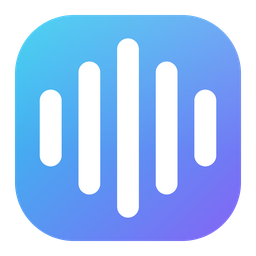
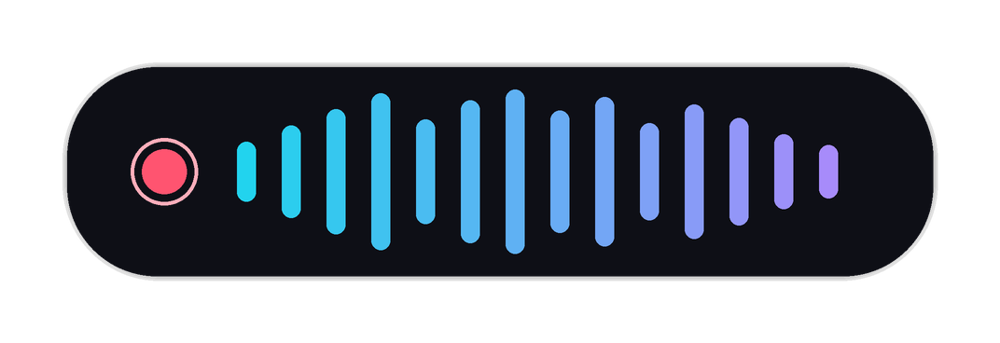
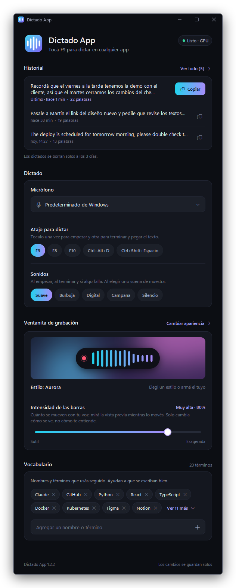
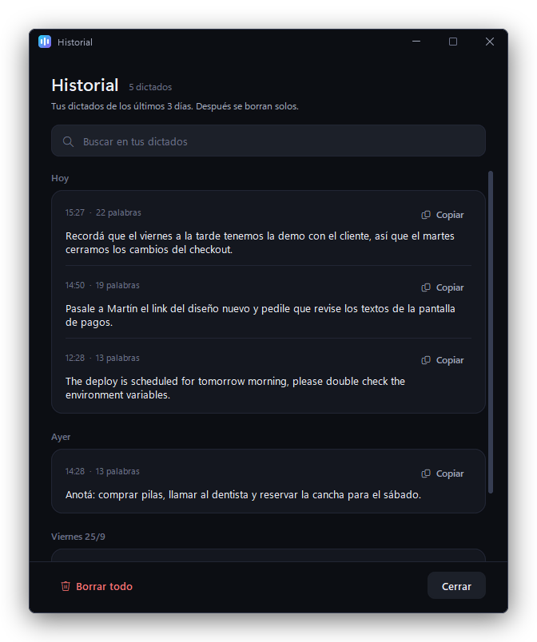
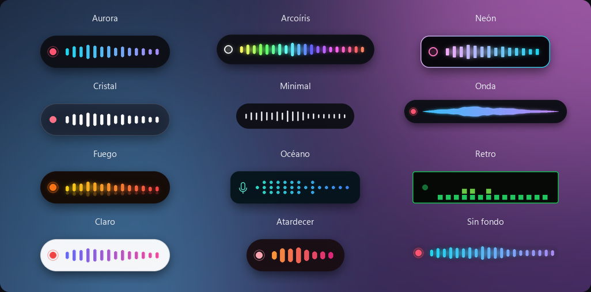
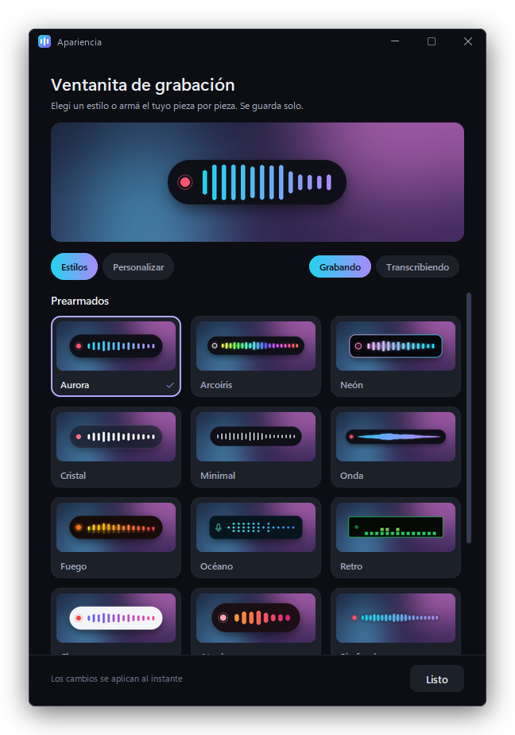

<p align="center">
  
</p>

<h1 align="center">Dictado App</h1>

<p align="center">
  <b>Voice dictation for Windows.</b> Press <kbd>F9</kbd>, speak, press <kbd>F9</kbd> again:
  your words are typed into whatever app you're using.
</p>

<p align="center">
  <b>100% local</b> · <b>private</b> · <b>free & open source</b> · GPU accelerated (NVIDIA)
</p>

<p align="center">
  
</p>

---

## What it is

Dictado App is a free, local, open source dictation app for Windows, in the spirit of
[Wispr Flow](https://wisprflow.ai). Tap <kbd>F9</kbd> to start recording (a floating overlay shows your voice
spectrum in real time), tap <kbd>F9</kbd> again, and [OpenAI's Whisper](https://github.com/openai/whisper)
transcribes **on your own GPU** and pastes the text into the field you're in: browser, chat, editor, IDE, **any app**.

It lives in the system tray, starts with Windows, and stays out of your way.

> **No cloud. No account. No subscription. Your audio never leaves your PC.**

## Demo

| Recording | Transcribing |
|:---:|:---:|
|  |  |

The overlay floats on top, is click-through and never steals focus, so the paste lands exactly where your cursor is.

## Features

- ⚡ **Real-time local transcription** with Whisper `large-v3-turbo` on your GPU (sub-second on an RTX 3070)
- 🌎 **Spanish + English** with automatic language detection
- 📋 **Pastes into any app**, including Chromium/Electron apps (Slack, Discord, browsers), via real scan-code <kbd>Ctrl</kbd>+<kbd>V</kbd>
- 🎯 **Pastes where you finish**: click another field while you talk and the text goes there
- 🎨 **Customizable overlay**: 12 ready-made styles (including an animated rainbow) or build and save your own
- 🗣️ **Custom vocabulary**: names and terms you use often, so Whisper writes them right
- 🕘 **Backup history** of your last 3 days of dictations, searchable, one click to copy (older ones are deleted automatically)
- 🔒 **100% offline**: private by design, nothing is uploaded
- 🔔 **Clear feedback**: sound + notification if the mic captured nothing or a paste failed, instead of silently doing nothing
- 💤 **Resilient to sleep/resume**: re-arms the hotkey and refreshes audio after your PC wakes up
- 🔄 **Updates itself**: when a new version is published it downloads it in the background, verifies it
  (SHA-256) and installs it while you're not dictating, keeping your settings, vocabulary and history

## Settings

Double-click the tray icon. Everything saves on its own, and changes apply instantly (no restart).

<p align="center">
  
  &nbsp;
  
</p>

- **Microphone** and **hotkey** (<kbd>F9</kbd>, <kbd>F8</kbd>, <kbd>F10</kbd>, <kbd>Ctrl</kbd>+<kbd>Alt</kbd>+<kbd>D</kbd> or <kbd>Ctrl</kbd>+<kbd>Shift</kbd>+<kbd>Space</kbd>)
- **Shortcut to open Settings** (<kbd>Ctrl</kbd>+<kbd>F1</kbd>, <kbd>Alt</kbd>+<kbd>F1</kbd>, <kbd>Shift</kbd>+<kbd>F1</kbd>, <kbd>Ctrl</kbd>+<kbd>Shift</kbd>+<kbd>F1</kbd>, <kbd>Ctrl</kbd>+<kbd>Alt</kbd>+<kbd>H</kbd> or none). If another app already uses it, you're told right away
- **Vocabulary** as tags: add with <kbd>Enter</kbd> (paste a comma separated list to add many), remove with ✕
- **History**: your latest dictations at a glance, and **See all** opens a window with search and copy for each one

> Screenshots use sample data.

## Make it yours

The floating recording overlay is fully customizable. Pick one of **12 ready-made styles**, or build your
own piece by piece and save it with a name. It's a real per-pixel-alpha window, so shadows, glass,
glow and "no background" styles look right on top of anything.

<p align="center">
  
</p>

<p align="center">
  
</p>

- **Shape & background**: pill, rounded or square; small, normal or large; solid, glass or no background; border and shadow
- **Recording dot**: halo, dot, ring, microphone or none, any color, with a heartbeat, blink or still
- **Voice bars**: rounded, square, dots, wave, mirror or retro blocks; 8 to 28 bars; thin to thick;
  gradient, single color, rainbow or **animated rainbow**; optional glow; smooth to snappy motion
- **Bar intensity**: a slider for how exaggerated the bars react to your voice (high by default, so even a
  quiet or distant voice is clearly visible). It only changes the visuals, never the transcription
- **While transcribing**: dots, orbit, wave or progress bar
- **Position**: bottom or top of the screen
- **Sounds**: Soft, Bubble, Digital, Bell or silent

Hover a style to preview it live; everything applies instantly.

## Requirements

- **Windows 10/11** (64-bit)
- A **microphone**
- **GPU:** an **NVIDIA** card (CUDA) for real-time speed. Without one, Dictado App falls back to **CPU** automatically: it still works, just slower.

## Install

1. Download the latest **`DictadoApp-Setup.exe`** from the [Releases](../../releases) page.
2. Run it. It installs to `%LOCALAPPDATA%\Programs\Dictado App`, adds a Start Menu shortcut and starts with Windows.
3. The first launch loads the model into memory (a few seconds). After that it's always warm.

> The installer is large (~1 GB) because it bundles the CUDA runtime, so it works out of the box on NVIDIA GPUs.
>
> **Upgrading from Dictalo?** That was this app's previous name. The installer replaces it and keeps your vocabulary and history.

## Usage

- **Tap <kbd>F9</kbd>** to start recording, **tap <kbd>F9</kbd>** again to stop. The text is pasted where your cursor is.
- **<kbd>Ctrl</kbd>+<kbd>F1</kbd>** from any app opens Settings with your history on top: press <kbd>Enter</kbd>
  to copy your last dictation and close it (focus goes back to where you were, ready for <kbd>Ctrl</kbd>+<kbd>V</kbd>),
  or <kbd>Esc</kbd> to close. Press <kbd>Ctrl</kbd>+<kbd>F1</kbd> again to hide it. You can change or disable it in Settings.
- **Double-click the tray icon** to open Settings.
- Quit from the tray icon: **Salir**.

## Build from source

Requires **Python 3.14** (64-bit) and an NVIDIA GPU for the CUDA path.

```bash
# 1. Virtual environment + dependencies (~2-3 GB: faster-whisper, CUDA libs, PyInstaller)
py -3.14 -m venv .venv
.venv\Scripts\python.exe -m pip install -r requirements.txt

# 2. Run in dev (with console logs)
.venv\Scripts\python.exe main.py

# 3. Build the standalone .exe  ->  dist\DictadoApp\
.venv\Scripts\pyinstaller.exe dictado.spec --noconfirm

# 4. (optional) Build the installer  ->  Output\DictadoApp-Setup.exe   (needs Inno Setup 6)
"%LOCALAPPDATA%\Programs\Inno Setup 6\ISCC.exe" installer.iss
```

The Whisper model is cached separately in `~/.cache/huggingface` (downloaded once, shared across builds).
Icon and screenshots are generated by the scripts in `assets/`.

## How it works

100% Python. The pieces:

| File | Role |
|---|---|
| `main.py` | Tray, state machine, hotkey wiring, sleep/resume watchdog |
| `recorder.py` | 16 kHz mic capture + live FFT spectrum for the overlay |
| `transcriber.py` | Whisper via [faster-whisper](https://github.com/SYSTRAN/faster-whisper) on CUDA (int8), CPU fallback |
| `injector.py` | Pastes text: refocuses your window + clipboard + scan-code Ctrl+V |
| `overlay.py` | Floating, click-through, top-most overlay that never takes focus (Win32 layered window, per-pixel alpha) |
| `looks.py` | Overlay styles: presets, validation and the frame renderer (PIL, supersampled) |
| `settings.py` · `ui.py` | Settings and History windows, on a small UI kit with anti-aliased shapes and Windows 11 fonts and icons |
| `updater.py` | Self-update from GitHub Releases (SHA-256 verified, installs only while idle) |
| `globalkey.py` | Global shortcut to open Settings (`RegisterHotKey`, detects when another app already owns it) |
| `brand.py` | Name, version and the icon (drawn in code, pixel-aligned for tiny tray sizes) |
| `config.py` · `history.py` · `sounds.py` · `splash.py` | Preferences, backup history, sounds, loading splash |

Whisper is OpenAI's open source model (MIT). Dictado App runs it locally through faster-whisper: **the OpenAI API is never called**.

## Compatibility

Dictado App is **Windows only**. It relies on native Windows APIs for text injection, the overlay and the hotkey.

| Setup | Status |
|---|---|
| **Windows + NVIDIA GPU** | ✅ Full speed (CUDA) |
| **Windows + AMD / Intel / no GPU** | ✅ Works on **CPU** (slower), same model and accuracy, using all CPU cores. Optional **Fast** model in Settings (about 3× faster, less accurate) |

## Roadmap

- 🎮 **AMD/Intel GPU acceleration** via whisper.cpp + Vulkan

## Privacy

Everything runs on your machine. Audio is captured, transcribed locally, and discarded. The only network access
Dictado App makes is a **one-time model download** on first run and an **update check** every few hours (it asks
GitHub for the latest release; nothing about you or your dictations is sent). There is no telemetry and no account.

## Credits & license

- [OpenAI Whisper](https://github.com/openai/whisper): the speech recognition model (MIT)
- [faster-whisper](https://github.com/SYSTRAN/faster-whisper): fast local inference (MIT)

Released under the [MIT License](LICENSE).
